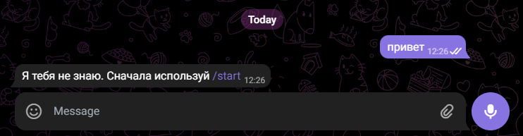
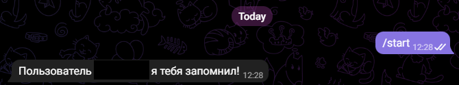
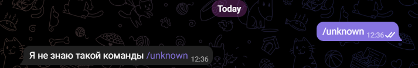
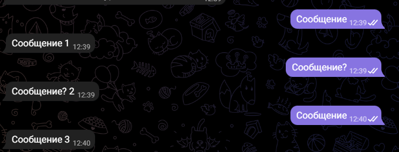

# telegram-request-counter

## Структура приложения

## Системные требования 

Java 17
PosgreSQL 15.1

## Запуск локального сервера БД

Для запуска может использоваться Docker образ:

````
docker-compose -f .\dev-container\src\main\resources\docker-compose.yml up
````

## Запуск локального сервера приложения

На данный момент не поддерживает автоматический запуск приложения в Docker контейнере.  
Возможожен запуск через терминал:

````
mvn -pl request-counter-application -am package
java -jar .\request-counter-application\target\request-counter-application-1.0-SNAPSHOT.jar --bot_key=key --default_delay=1000

````

## Пример работы
### Пример 1
Пользователь не зарегестрирован и делает попытку ввод echo message


### Пример 2
Неизвестный системе пользователь выполняет регистрацию


### Пример 3
Уже зарегестрированный пользователь выполняет регистрацию


### Пример 4
Зарегестрированный или незарегестрированный пользователь отправляет неизвествую команду


### Пример 5
Зарегестрированный пользователь отправляет echo message
Ответное время сообщение будет получен через двойное время задержки, т.к. сначала ожидает заданный промежуток времени 
в очереди сообщений, а затем выполняется задержка при получении сообщения через REST API (по описанию из ТЗ).


### Пример 6
Обновление времени задержки через REST API
````
POST http://localhost:8080/updateQueueDelay
{
    "new_delay": 4000 // Время в миллисекундах
}
````
Значение "new_delay" должно быть неотрицательным, при выполнении некорректного запроса будет получен форматированный ответ с описанием ошибки для поля.
````
POST http://localhost:8080/updateQueueDelay
{
    "new_delay": -1 // Время в миллисекундах
}

Response:
{
    "delay": [
        "должно быть больше или равно 0"
    ]
}
````